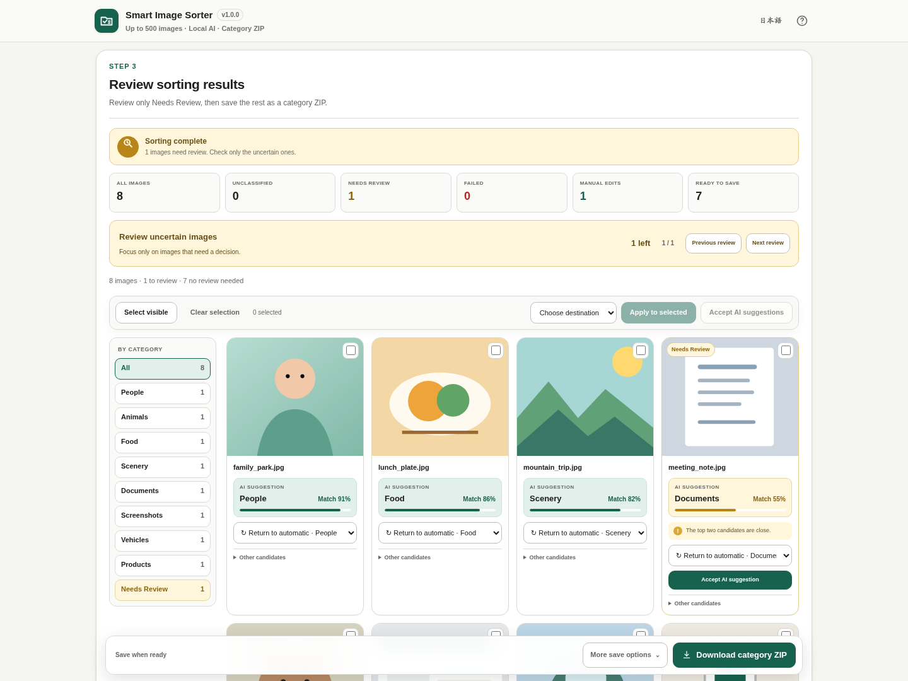
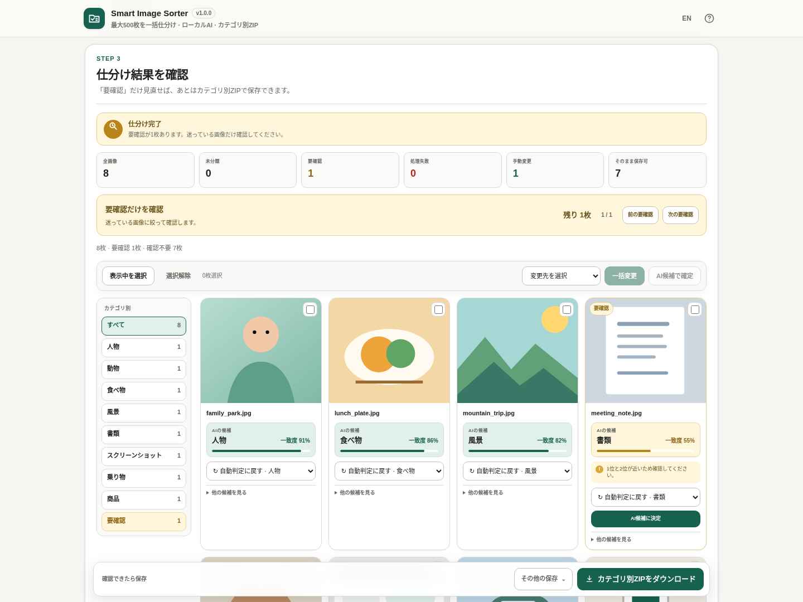

# Smart Image Sorter

[](https://github.com/ttomohisa/htmlapps-smart-image-sorter/actions/workflows/deploy-pages.yml)
[](LICENSE)
[](https://ttomohisa.github.io/htmlapps-smart-image-sorter/)
[](#privacy-and-runtime-network-protection)

[日本語版 README](README.ja.md)

Smart Image Sorter is a single-HTML browser app for sorting batches of images with local AI. It classifies up to 500 images into predefined categories, lets you review uncertain results, and downloads the original files grouped into category ZIP folders.

Selected images are not uploaded by the app. Classification, review, work-session metadata, and ZIP generation stay on the device.

## 🚀 Live demo

### [Open Smart Image Sorter on GitHub Pages](https://ttomohisa.github.io/htmlapps-smart-image-sorter/)

GitHub Pages serves the initial HTML. After it loads, image processing runs locally in the browser. No installation or account is required.

## Screenshots

### English UI



### 日本語 UI



## Features

- **Sort up to 500 images at once** — Add individual images or choose a folder.
- **Predefined category catalog** — Start with eight recommended categories and enable only what you need from the built-in catalog.
- **Review only uncertain results** — Images with close or low-scoring candidates are separated into a focused review flow.
- **Manual and bulk correction** — Move individual images or selected images to another category. Bulk changes require confirmation.
- **Failure isolation** — A broken or unsupported image does not stop the rest of the batch; failed items can be retried or removed.
- **Original bytes in category ZIPs** — Images are not recompressed when exported. Filename collisions are resolved safely inside each category folder.
- **Autosave and restore** — Classification results and manual edits are saved locally; reselect the same files to restore the work session.
- **Single-HTML local runtime** — TinyCLIP vision-only INT8, label embeddings, Transformers.js, and ONNX Runtime Web are embedded into the release HTML.
- **Japanese / English UI** — Both languages are included in the same file.

## Quick start

### Use the web demo

Open the [GitHub Pages demo](https://ttomohisa.github.io/htmlapps-smart-image-sorter/), add images, choose at least two categories, and start sorting.

### Build a standalone HTML on Windows

1. Download or clone this repository.
2. Run:

```bat
setup-and-build.bat
```

3. Open the generated `index.html`.

The first setup downloads the pinned browser runtime files and TinyCLIP metadata. The release vision-only INT8 ONNX model and precomputed label embeddings are committed to the repository.

Normal builds do not require Python, uv, or the ONNX Python package. After setup assets are available, rebuild with:

```bat
build-standalone.bat
```

## Usage

1. **Add images** — Choose JPEG / PNG / WebP / AVIF files or a folder containing them.
2. **Choose categories** — Eight recommended categories are enabled initially. Keep only the categories relevant to the batch; at least two are required.
3. **Start sorting** — The local TinyCLIP vision model calculates image embeddings and compares them with precomputed category label embeddings.
4. **Review uncertain images** — Use the needs-review flow only when the app flags ambiguous results.
5. **Correct results if needed** — Change one image, or select several and apply a confirmed bulk change.
6. **Download the category ZIP** — Original image bytes are grouped by category without recompression.

### What “Needs review” means

An image is sent to review when its top match is relatively low, when the first and second candidates are close, or both. The displayed match value is a **relative score among the currently enabled categories**, not the probability that the result is correct.

### Failed images

Decode or inference failures are separated from normal results. Other images continue processing. Failed items can be retried individually or together, or removed from the working set. Failed images are not included in the category ZIP.

### Autosave and restore

The app stores category selection, strictness, compact classification results, review state, manual corrections, and file identity metadata in the browser. It does **not** save image bytes or image embeddings.

To restore work, reselect the same files or folder. Matching uses relative path when available, plus filename, size, and last-modified time. Work JSON export/import is available as an explicit backup.

## Fixed categories and developer maintenance

Normal users choose from the predefined catalog. The release UI does not accept arbitrary free-text categories.

Category definitions live in:

```text
data/fixed-label-prototypes.json
```

When adding/removing a category or changing its prototype prompts:

```bat
dev-update-label-embeddings.bat
build-standalone.bat
```

`dev-update-label-embeddings.bat` regenerates:

```text
data/fixed-label-embeddings.tinyclip-int8.generated.json
```

Changing category definitions **does not require rebuilding the release TinyCLIP vision-only model**. The normal build verifies that the category definitions and committed label embeddings match and stops if they are stale.

Only vision-model replacement/re-extraction uses `dev-reextract-vision-model.bat` and the project-local Python / uv / ONNX maintenance environment. See [DEVELOPMENT.md](DEVELOPMENT.md).

## Category regression test

A developer-only regression screen is available at:

```text
index.html#accuracy-test
```

It reports Top-1 / Top-3, macro accuracy, recommended-category accuracy, review rate, per-category accuracy, and common confusions. It also includes a dataset-review UI for keeping, excluding, or relabeling test images.

Useful commands:

```bat
collect-regression-images.bat
check-regression-dataset.bat -Strict
```

See [tests/accuracy/README.md](tests/accuracy/README.md) for details.

## Publish with GitHub Pages

The repository includes GitHub Actions for pull-request build validation and automatic deployment from `main`.

1. Open **Settings → Pages → Build and deployment → Source** and select **GitHub Actions** once.
2. Push to `main`.
3. **Deploy standalone app to GitHub Pages** verifies the committed release model, downloads pinned runtime assets, builds `dist/index.html`, checks the standalone CSP/build markers, and deploys `dist`.
4. The demo is published at `https://ttomohisa.github.io/htmlapps-smart-image-sorter/`.

If Pages has not been enabled yet, the build succeeds and the workflow summary explains the one-time setup while skipping deployment.

## Development and build layout

```text
.
├─ src/index.template.html
├─ app.config.json
├─ schemas/app-config.schema.json
├─ assets/
│  ├─ favicon.svg
│  ├─ screenshot-en.png
│  └─ screenshot-ja.png
├─ data/
│  ├─ fixed-label-prototypes.json
│  └─ fixed-label-embeddings.tinyclip-int8.generated.json
├─ models/
│  └─ TinyCLIP-ViT-8M-16-Text-3M-YFCC15M-ONNX/
│     └─ onnx/vision_model_quantized.onnx
├─ tools/
├─ tests/
├─ .github/workflows/
│  ├─ build-standalone.yml
│  └─ deploy-pages.yml
├─ setup-and-build.bat
└─ build-standalone.bat
```

The committed release model is 8,957,217 bytes and has SHA-256:

```text
bbf8426b0e548881dcfd9257030dd6139fceeeb4808994968b882ecc3ada291f
```

## Privacy and runtime network protection

The generated standalone HTML is designed to keep user images on the device.

- Selected images are not uploaded by the app.
- The AI model and required browser runtime are embedded into the release HTML.
- Content Security Policy blocks external runtime network access.
- ZIP generation runs locally in the browser.
- Autosave does not include image bytes.

The hosted demo still requires the initial HTML request. For fully disconnected use, build `index.html`, disconnect the network, and open the file locally. See [VERIFY_OFFLINE.md](VERIFY_OFFLINE.md).

## Limitations

- Up to 500 images can be loaded in one batch.
- Categories are predefined at build time.
- Match values are relative scores, not correctness probabilities.
- Image decoding support varies by browser and platform.
- Large batches of high-resolution images can use substantial device memory.
- ZIP creation is limited to 750 MB of selected source images in one export.
- Failed images are excluded from the category ZIP.
- Work restore requires reselecting the original image files.

## Components

| Component | Version / configuration | License | Purpose |
| --- | --- | --- | --- |
| TinyCLIP | ViT-8M/16 vision-only INT8 | See upstream model terms | Image embedding |
| @huggingface/transformers | 3.8.1 | Apache-2.0 | Model preprocessing and browser runtime support |
| onnxruntime-web | 1.22.0-dev.20250409-89f8206ba4 | MIT | ONNX inference |

See [THIRD_PARTY_NOTICES.md](THIRD_PARTY_NOTICES.md) for third-party details.

## Contributing

Bug reports and feature proposals are welcome through GitHub Issues. See [CONTRIBUTING.md](CONTRIBUTING.md) for development guidance.

## License

Copyright © 2026 ttomohisa

Licensed under the [MIT License](LICENSE).
